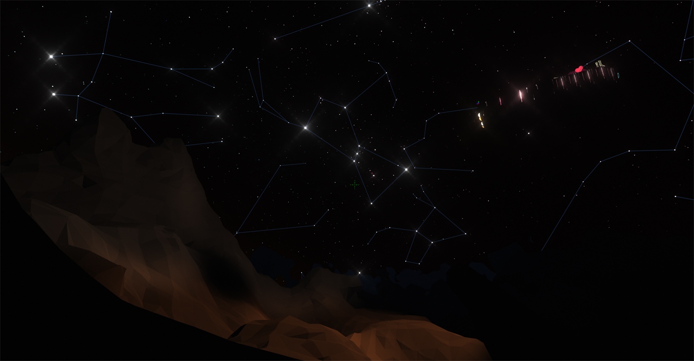
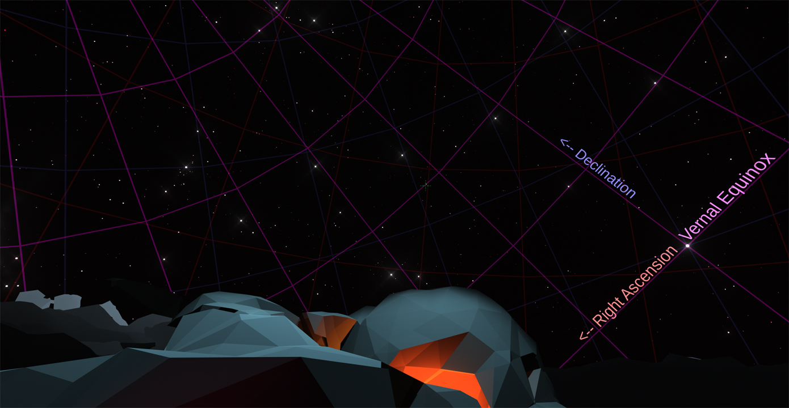

# Astronomic Skybox
Realtime, true-to-life, star and sky simulator for Unity. Perfect for recreating real-world places, time lapse effects, impressive day/night cycles, or just stargazing!

## [Install through Package Manager](https://docs.unity3d.com/Manual/upm-ui-giturl.html)

## How it works
* The **skybox** is the bread and butter of this package. Its goal is to simulate the sky as accurately as possible
  * Supports three celestial coordinate systems
    *  The **Horizontal coordinate system** is the view from a given point on earth.
    *  The **Equatorial coordinate system** is centered around Earth and its equator. This is what the stars are mapped to.
    *  The **Ecliptic coordinate system** is centered around Earth in this instance and the orbital plane of the planets.
  *  The coordinate systems are rotated to accurately simulate the positions of objects in the sky at any given time.
  *  It also provides direct sun lighting, an ambient light cluster, and reflected light from the moon.
*  **StarPositioner.cs** orients the skybox to be accurate to specific dates, times and places on Earth.
*  **StarGenerator.cs** generates stars and constellations for the skybox.
*  **StarMath.cs** contains a bunch of methods for converting coordinate systems and calculating the position of the sun and moon.

[stellarData.txt is sourced from astronexus/HYG-Database](https://github.com/astronexus/HYG-Database/blob/master/hygdata_v3.csv)
